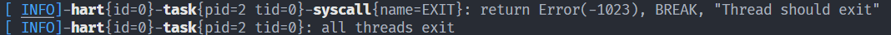

# kernel_tracer

综合参考 log、tracing、puffin 等库设计的内核用日志、跟踪、性能分析库。

自己造轮子是因为一来有一些性能上的问题，希望可以优化；二来是这些库有些太过复杂，超出了内核的需求范围。

## 日志事件

同 `log` 库，简单调用 `trace!()`、`debug!()`、`info!()`、`warn!()`、`error!()` 等宏即可。

宏用法除去不接受空参数外**完全等同** `println!()`

## span

参考自 tracing 的 span。描述一个范围，比如一个函数的调用范围。

通常通过调用 `trace_span!()`、`debug_span!()`、`info_span!()`、`warn_span!()`、`error_span!()` 等宏使用。

```rust
let _enter = info_span!("hart", id = hart_id).entered();
```

注意，宏的返回值是一个 `Span` 结构体，此时尚未激活，需要对其调用 `entered()` 函数才正式进入该 span。`entered()` 返回一个 guard，当 guard drop 时，则退出该 span。

激活的 span 才会被输出。

如下输出中，白色加粗的 `hart`、`task`、`syscall` 代表三层 span。



（注意 span 本身不会导致输出，它是一个上下文环境，会影响日志事件的输出）

span 需要严格遵循栈结构，先进后出。因此不要手动 drop span 或者 _enter，使其自然退出作用域即可。

在异步情况下，enter guard 无法跨 await 点存在。这是刻意如此设计，否则会有预料之外的结果。

若希望 span 的覆盖一个异步函数，应当对其使用 `instrument()` 组合子，如下：

```rust
some_future
.instrument(info_span!("syscall", name = syscall::name(syscall_id)))
.await
```

`*_span!()` 宏的语法示例如下：

- `*_span!("name")`
- `*_span!("name", key1 = value1, key2 = value2)`

也就是说必须有一个名字，然后可以接受零个或多个键值对。

值类型需要实现 `Loggable` trait。目前比较麻烦。
